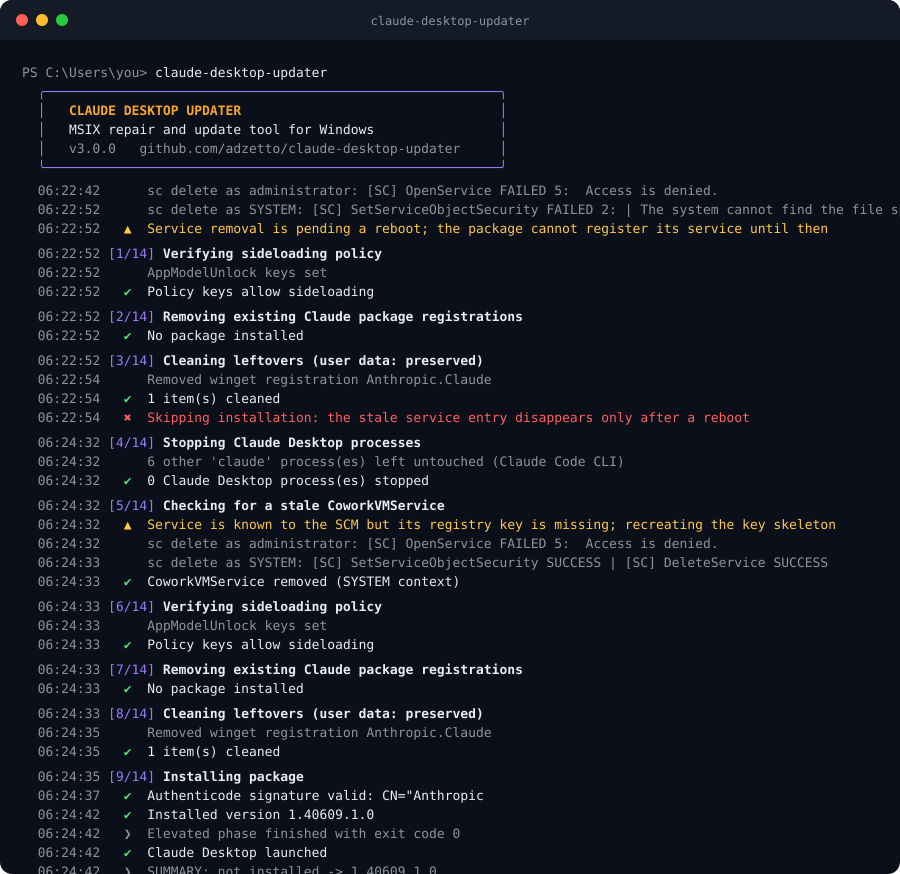

<p align="center">
  
  
</p>

<h1 align="center">claude-desktop-updater</h1>

<p align="center">
  A repair and update tool for Claude Desktop on Windows, for the case where the in-app updater
  and the official <code>Claude Setup.exe</code> both fail and every release forces a manual wipe and reinstall.
</p>

<p align="center">
  <a href="https://github.com/adzetto/claude-desktop-updater/releases"></a>
  
  
  <a href="LICENSE"></a>
</p>

## The problem

Claude Desktop for Windows is distributed as an MSIX package. Starting with the releases that ship the Cowork feature, the package contains a packaged Windows service (`CoworkVMService`). On a number of machines the official bootstrapper cannot replace an existing installation, and the in-app "Update" button silently does nothing. The setup log at `%TEMP%\ClaudeSetup.log` tells the whole story:

```
WARNING: CoworkVMService already exists (potential conflict)
Removing conflicting CoworkVMService...
WARNING: failed to remove conflicting service: could not open CoworkVMService: Access is denied.
Removing: Claude_1.40609.0.0_x64__pzs8sxrjxfjjc
Windows rejected data-preserving removal (0x80073CFA, requires developer mode); relying on in-place update
Installing via AddPackage (current-user)...
MSIX installation failed: AddPackage failed with HRESULT 0x80073CFF
ERROR dialog: Administrator access is required to install Claude with full features.
```

The visible symptom is the misleading "administrator access is required" dialog, even though the installer was already elevated. The only workaround people find is to uninstall the app completely and install the new build from scratch, losing time on every release.

## Root cause

The investigation behind this tool surfaced a chain of four independent failures. Each one alone is survivable; together they lock the update path.

| # | Layer | What actually happens | Error |
|---|-------|----------------------|-------|
| 1 | Windows service | The `CoworkVMService` left by the previous version carries a security descriptor that denies even administrators (`OpenService` fails with error 5). `sc delete` and the bootstrapper's own removal both fail. Deleting the registry key by hand makes it worse: the Service Control Manager keeps its in-memory entry, and the next registration fails with `0x80073CF6` / `0x80070002` until a reboot. | `Access is denied` |
| 2 | AppX deployment | The bootstrapper tries a data-preserving `RemovePackage`. Windows only allows that with an active developer license, so it is rejected. | `0x80073CFA` |
| 3 | Group Policy / MDM | On managed devices `HKLM\SOFTWARE\Policies\Microsoft\Windows\Appx` contains `AllowAllTrustedApps = 0`. This policy key overrides `AppModelUnlock`, so Developer Mode looks enabled in Settings while sideloading is in fact blocked. `AddPackage` then fails with the generic "you need a developer license or a sideloading-enabled system". | `0x80073CFF` |
| 4 | Packaged service | Because the MSIX registers a service, a non-elevated `AddPackage` is refused outright. Any tool that installs in the user context (winget, `Add-AppxPackage` from a normal shell) hits this. | `0x80073D28` |

A fresh machine has no stale service and no policy override, which is why a full wipe "works". The updater fixes the four layers in order instead.

## What the tool does

The run is split into two phases so that the UAC prompt appears once and never sits open during a 250 MB download.

**User phase.** Detect the installed package and its health state, resolve the latest release for the machine architecture (x64 or arm64) from Anthropic's official redirect endpoint, download the MSIX with BITS (resumable, live progress with throughput and ETA) and fall back to a Range-aware HTTP stream if BITS is unavailable, verify the Authenticode signature and the signer (`CN=Anthropic, PBC`), then hand the file to the elevated phase through a fixed path under `%ProgramData%` so nothing depends on command-line quoting.

**Elevated phase.** Stop only genuine Claude Desktop processes (the `claude` Claude Code CLI is matched by path and left alone), delete `CoworkVMService` through the Service Control Manager, first as administrator and then as `SYSTEM` via a one-shot scheduled task because the service descriptor only grants `SYSTEM` (the registry key is dropped only as a last resort, in which case the tool stops and asks for a reboot instead of producing a broken registration), write the sideloading keys in both `AppModelUnlock` and the policy location and restart `AppXSvc` so the change is picked up, remove stale package registrations (user, all-users and provisioned), clean Squirrel-era leftovers and the winget record, install the package through the WinRT `PackageManager` with a real percentage bar (falling back to `Add-AppxPackage` in a background job with an animated bar), verify the registration and launch the app.

User data (`%LOCALAPPDATA%\Claude` and the package data folder) is preserved by default. A failed run keeps the downloaded package so the next attempt does not download it again.

<p align="center">
  
</p>

## Usage

Download `claude-desktop-updater.exe` from the releases page, or build it yourself (see below), then run it from any terminal:

```
claude-desktop-updater
```

| Flag | Effect |
|------|--------|
| `-Force` | Reinstall even when the installed version already matches the latest release. |
| `-CleanOnly` | Run the cleanup steps only. Nothing is downloaded or installed. |
| `-PurgeUserData` | Also delete `%LOCALAPPDATA%\Claude` and the package data folder (sign-in required afterwards). |
| `-NoLaunch` | Do not start Claude Desktop, and do not open the download page on failure. |
| `-NoColor` | Plain output without ANSI colours or animations. |

The script form works the same way: `powershell -ExecutionPolicy Bypass -File claude-desktop-updater.ps1 -Force`.

| Exit code | Meaning |
|-----------|---------|
| 0 | Success, or already up to date. |
| 1 | Installation failed after every strategy. |
| 2 | Release could not be resolved or downloaded. |
| 3 | The UAC prompt was refused. |
| 4 | Sideloading is blocked by device management and the policy could not be changed. |
| 5 | A reboot is required to finish removing the stale service. Run the tool again after restarting; the downloaded package is reused. |

Logs are written to `%ProgramData%\claude-desktop-updater\updater.log`; the elevated phase logs to its own file and is merged at the end.

## Building

```powershell
git clone https://github.com/adzetto/claude-desktop-updater.git
cd claude-desktop-updater
.\build.ps1 -Install
```

`build.ps1` installs the `ps2exe` module in the current user scope if needed, parse-checks the script, compiles it to `dist\claude-desktop-updater.exe` and, with `-Install`, copies it to `%ProgramData%\claude-desktop-updater` and adds that folder to the user `PATH`.

The logo is generated procedurally with numpy (`python assets/make_logo.py`): a Vogel sunflower lattice with a Gaussian ring profile, a 36-segment progress arc and a two-bar chevron, written as plain SVG so the repository carries no binary image assets.

## Managed devices

If the machine is enrolled in Intune or another MDM, the policy key that blocks sideloading is owned by the management profile and may be re-applied on the next sync. The updater sets it for the duration of the install and reports this in the log. The permanent fix on such devices is an MDM policy that allows trusted apps (`ApplicationManagement/AllowAllTrustedApps`).

## Safety

The tool only ever installs a package downloaded from `downloads.claude.ai` through Anthropic's own redirect endpoint, and refuses to install anything whose Authenticode chain is not valid or whose signer is not Anthropic. It changes exactly two policy values, restarts one service, and deletes one stale service registration. Nothing is sent anywhere.

## License

MIT
