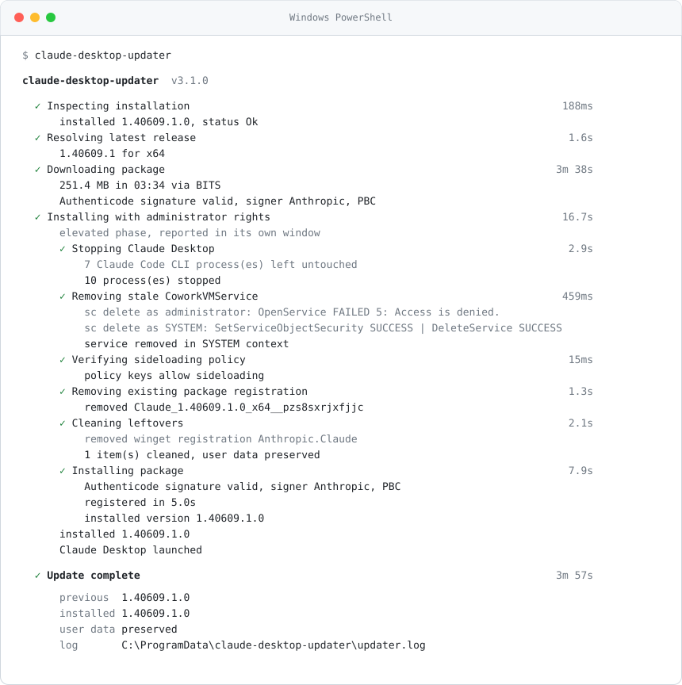
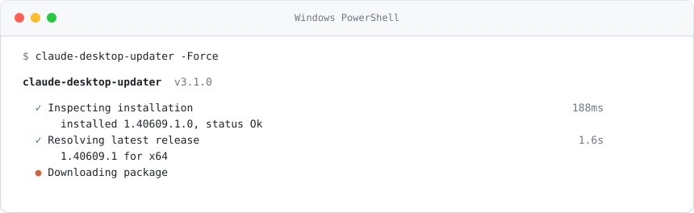

<p align="center">
  <picture>
    <source media="(prefers-color-scheme: dark)" srcset="assets/logo.svg">
    
  </picture>
</p>

<h1 align="center">claude-desktop-updater</h1>

<p align="center">
  Repairs and updates Claude Desktop on Windows when the in-app updater and the official installer fail.<br>
  One command, one UAC prompt, no more wipe-and-reinstall on every release.
</p>

<p align="center">
  <a href="https://github.com/adzetto/claude-desktop-updater/releases/latest"></a>
  
  
  <a href="LICENSE"></a>
</p>

<p align="center">
  <picture>
    <source media="(prefers-color-scheme: dark)" srcset="assets/terminal.svg">
    
  </picture>
</p>

## Install

Download `claude-desktop-updater.exe` from the [latest release](https://github.com/adzetto/claude-desktop-updater/releases/latest) and run it from any terminal. It needs no dependencies, asks for administrator rights once after the download has finished, and keeps your sessions and settings.

```
claude-desktop-updater
```

<p align="center">
  <picture>
    <source media="(prefers-color-scheme: dark)" srcset="assets/terminal-progress.svg">
    
  </picture>
</p>

## The problem it solves

Claude Desktop for Windows is an MSIX package that carries a packaged Windows service (`CoworkVMService`). On many machines the official bootstrapper cannot replace an existing installation, the in-app Update button does nothing, and `%TEMP%\ClaudeSetup.log` ends like this:

```
WARNING: CoworkVMService already exists (potential conflict)
WARNING: failed to remove conflicting service: could not open CoworkVMService: Access is denied.
Windows rejected data-preserving removal (0x80073CFA, requires developer mode); relying on in-place update
MSIX installation failed: AddPackage failed with HRESULT 0x80073CFF
ERROR dialog: Administrator access is required to install Claude with full features.
```

The dialog is misleading, the installer was already elevated. Four independent failures stack up, and a fresh machine avoids all of them, which is why a complete uninstall "works".

| | Layer | What happens | Error |
|---|---|---|---|
| 1 | Service Control Manager | The stale `CoworkVMService` has a security descriptor that only grants its own service SID; even administrators get `OpenService` error 5, so neither `sc delete` nor the bootstrapper can remove it. Deleting the registry key by hand makes it worse: the SCM keeps its in-memory entry and the next registration fails with `0x80073CF6` until a reboot. | `Access is denied` |
| 2 | AppX deployment | The bootstrapper attempts a data-preserving `RemovePackage`, which Windows only allows with an active developer license. | `0x80073CFA` |
| 3 | Group Policy / MDM | Managed devices carry `AllowAllTrustedApps = 0` under `HKLM\SOFTWARE\Policies\Microsoft\Windows\Appx`. The policy key overrides `AppModelUnlock`, so Developer Mode looks enabled while sideloading is blocked, and `AddPackage` fails with the generic "developer license or sideloading-enabled system" message. | `0x80073CFF` |
| 4 | Packaged service | A package that registers a service cannot be installed from a user context. winget and a plain `Add-AppxPackage` both hit this. | `0x80073D28` |

## How it works

The run has two phases so that the UAC prompt appears once and never stays open during a 250 MB download.

The user phase inspects the installed package, resolves the latest release for the machine architecture (x64 or arm64) through Anthropic's official redirect endpoint, downloads the MSIX with BITS (resumable, live throughput and remaining time, HTTP fallback with `Range` resume), verifies the Authenticode chain and the signer (`Anthropic, PBC`), and queues the file under `%ProgramData%` for the elevated phase.

The elevated phase stops only genuine Claude Desktop processes (the Claude Code CLI is matched by path and left alone), deletes `CoworkVMService` through the SCM as `SYSTEM` via a one-shot scheduled task, repairs the sideloading keys in both `AppModelUnlock` and the policy location and restarts `AppXSvc`, removes stale package registrations (user, all users, provisioned), cleans Squirrel-era leftovers and the winget record, installs the package through the WinRT `PackageManager` with a live progress line (falling back to `Add-AppxPackage`), verifies the registration and launches the app.

A failed run keeps the downloaded package, so the next attempt starts at the elevated phase.

## Usage

| Flag | Effect |
|---|---|
| `-Force` | Reinstall even when the installed version already matches the latest release. |
| `-CleanOnly` | Run the cleanup steps only. Nothing is downloaded or installed. |
| `-PurgeUserData` | Also delete `%LOCALAPPDATA%\Claude` and the package data folder (sign-in required afterwards). |
| `-NoLaunch` | Do not start Claude Desktop, and do not open the download page on failure. |
| `-NoColor` | Plain output without colours or animations. |

| Exit code | Meaning |
|---|---|
| 0 | Success, or already up to date. |
| 1 | Installation failed after every strategy. |
| 2 | The release could not be resolved or downloaded. |
| 3 | The UAC prompt was refused. |
| 4 | Sideloading is blocked by device management and the policy could not be changed. |
| 5 | A reboot is required to finish removing the stale service. Run again after restarting. |

The script works the same way without compiling: `powershell -ExecutionPolicy Bypass -File claude-desktop-updater.ps1 -Force`. Logs go to `%ProgramData%\claude-desktop-updater\updater.log`; the elevated phase writes its own file, merged at the end of the run.

## Build from source

```powershell
git clone https://github.com/adzetto/claude-desktop-updater.git
cd claude-desktop-updater
.\build.ps1 -Install
```

`build.ps1` installs the `ps2exe` module in the current user scope if needed, parse-checks the script, compiles `dist\claude-desktop-updater.exe` with the project icon and, with `-Install`, copies it to `%ProgramData%\claude-desktop-updater` and adds that folder to the user `PATH`.

Everything under `assets/` is generated: the mark (`make_logo.py`, a 300 degree ring and a chevron computed with numpy and written as SVG paths), the PNG and multi-size ICO (`rasterize.py`, signed-distance rasterisation with numpy, no SVG library involved) and the terminal screenshots (`make_terminal.py`, rendered from the log of a real run).

## Managed devices

If the machine is enrolled in Intune or another MDM, the policy key that blocks sideloading belongs to the management profile and may be re-applied on the next sync. The tool sets it for the duration of the install and says so in the log. The permanent fix on such devices is an MDM policy that allows trusted apps (`ApplicationManagement/AllowAllTrustedApps`).

## Safety

Only packages served from `downloads.claude.ai` through Anthropic's own redirect are installed, and nothing is installed unless the Authenticode chain is valid and the signer is Anthropic. The tool changes two policy values, restarts one service and deletes one stale service registration. It sends nothing anywhere.

## License

MIT
